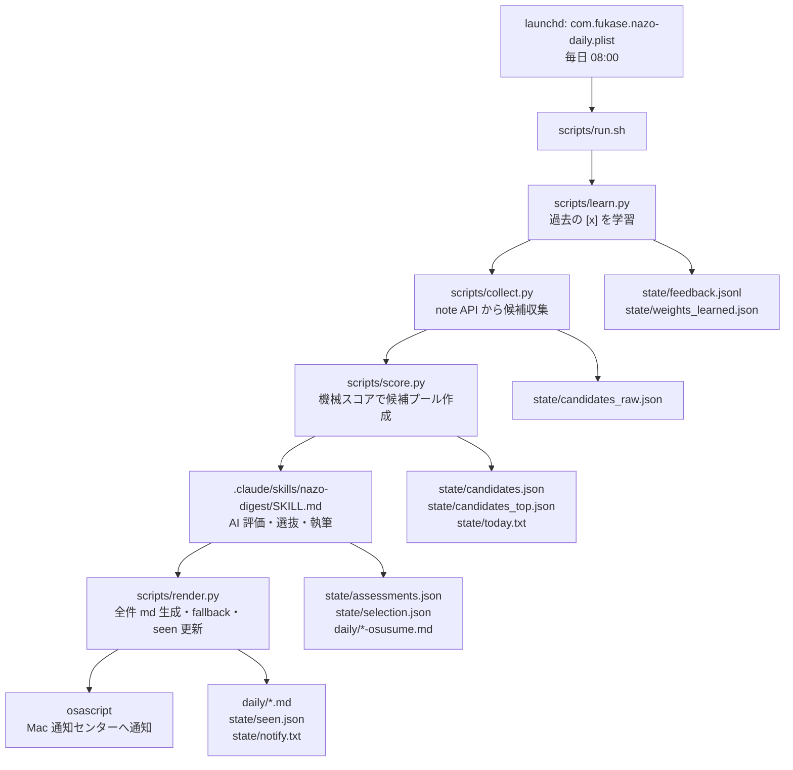

# 現行システム設計書

## 目的

このリポジトリは、毎日 note の「謎解き」関連記事を収集し、AI が全候補を評価・採点しておすすめ記事を選抜し、読むためのダイジェスト Markdown と学習用チェックリスト Markdown を生成する個人利用向けローカルシステムです。

主な成果物は次の2つです。

- `daily/YYYY-MM-DD-osusume.md`: AI がフランクな語り口で書くおすすめダイジェスト
- `daily/YYYY-MM-DD.md`: 全候補のチェックリスト。ユーザーが `- [ ]` を `- [x]` に変えると翌日以降の学習に使われる

## 全体像

## 実行起点

`com.fukase.nazo-daily.plist` は macOS の launchd 定義です。`StartCalendarInterval` により毎日 08:00 に `/bin/zsh -lc /Users/fukasedaichi/git/note/scripts/run.sh` を実行します。標準出力と標準エラーは `state/launchd.out.log` と `state/launchd.err.log` に出力されます。

`scripts/run.sh` は日次処理全体のオーケストレータです。ルートディレクトリ、Python パス、launchd 用 PATH を明示し、`daily/` と `state/` を作成します。Claude Code の headless 実行用トークンが `state/.claude_token` にあり、`sk-ant-` 形式なら `CLAUDE_CODE_OAUTH_TOKEN` として使います。

## 処理フロー

1. `learn.py`
   - 直近 60 日の `daily/*.md` を走査します。
   - `- [x] ... <!-- key=... tags=... -->` の形式を正規表現で抽出します。
   - 未記録の key だけ `state/feedback.jsonl` に追記します。
   - `feedback.jsonl` 全体から `state/weights_learned.json` を毎回再構築します。

2. `collect.py`
   - note の公開 JSON API `api/v3/searches` を `謎解き`、`一枚謎`、`自作謎` で検索します。
   - `sort=new`、直近 28 時間、各クエリ最大 6 ページ、1 ページ 20 件で収集します。
   - `state/seen.json` にある既出 key は除外します。
   - 各候補について `api/v3/notes/<key>` を取得し、タグ、URL、description、本文抜粋を補完します。
   - 結果を `state/candidates_raw.json` に保存します。

3. `score.py`
   - `state/weights_base.json` と `state/weights_learned.json` を合成します。
   - タグ重み、タイトル部分一致、鮮度、like 数から機械スコアを計算します。
   - 全件を `state/candidates.json` に、AI に渡す上位プールを `state/candidates_top.json` に保存します。
   - 本日の日付を `state/today.txt` に保存します。

4. `nazo-digest` スキル
   - `state/candidates_top.json` の全候補を AI が評価します。
   - `state/assessments.json` に AI スコア、ジャンル、一言要約を書きます。
   - `state/selection.json` におすすめ順位、紹介文、推薦理由を書きます。
   - `daily/YYYY-MM-DD-osusume.md` を執筆します。
   - `/nazo-digest` の headless 実行に失敗した場合、`run.sh` はスキル本文を直接プロンプトとして再試行します。

5. `render.py`
   - 全件チェックリスト `daily/YYYY-MM-DD.md` を生成します。
   - AI が `osusume.md` を作れなかった場合は、機械スコア順の暫定ダイジェストを生成します。
   - `state/seen.json` に今回候補の key を追加します。
   - 通知本文 `state/notify.txt` を生成します。

6. 通知
   - `run.sh` の `notify()` 関数が `osascript` で Mac 通知センターへ通知します。
   - 現状は Mac ローカル通知のみで、携帯への通知や携帯で読める URL はありません。

## ファイル責務

| ファイル | 種別 | 責務 |
| --- | --- | --- |
| `README.md` | ドキュメント | 利用方法、セットアップ、全体構成の説明 |
| `.gitignore` | Git 設定 | トークン、ログ、中間 JSON を除外。日次 md と学習データは追跡対象 |
| `com.fukase.nazo-daily.plist` | launchd | 毎日 08:00 の日次実行定義 |
| `scripts/run.sh` | 実行制御 | 学習、収集、採点、AI 呼び出し、描画、通知を順に実行 |
| `scripts/learn.py` | 学習 | チェック済み記事からタグ重みを更新 |
| `scripts/collect.py` | 収集 | note API から記事候補と詳細を取得 |
| `scripts/score.py` | 下ごしらえ | 機械スコア付与、AI 候補プール作成 |
| `scripts/render.py` | 出力 | 全件チェックリスト、暫定ダイジェスト、seen、通知文を生成 |
| `.claude/skills/nazo-digest/SKILL.md` | AI 指示 | AI 評価・選抜・執筆の手順と制約 |
| `.claude/settings.local.json` | 個人設定 | Claude Code のローカル権限設定。実行ロジック本体ではない |
| `daily/*.md` | 成果物 | 読むためのダイジェスト、学習用チェックリスト |
| `state/weights_base.json` | 永続設定 | 手動調整する基本タグ重み |
| `state/weights_learned.json` | 永続状態 | `[x]` フィードバックから再構築される学習タグ重み |
| `state/seen.json` | 永続状態 | 既出 note key の重複防止リスト |
| `state/feedback.jsonl` | 永続状態 | チェック済み記事の履歴 |
| `state/candidates*.json` | 中間生成物 | 収集・採点・AI 入力用候補データ |
| `state/assessments.json` | 中間生成物 | AI の全候補評価 |
| `state/selection.json` | 中間生成物 | AI のおすすめ選抜 |
| `state/today.txt` | 中間生成物 | 対象日付 |
| `state/notify.txt` | 中間生成物 | 通知文 |
| `state/*.log` | ログ | 日次処理と launchd のログ |

## 設計上の特徴

- Python は標準ライブラリのみを使っています。
- note API は非公式公開 API として扱われ、詳細取得に 0.4 秒スリープを入れています。
- AI が失敗しても、`render.py` が暫定版を出すため日次成果物は生成されます。
- ユーザーの好みは Markdown の checkbox だけで表現され、追加 UI はありません。
- 学習データは key で重複排除され、`weights_learned.json` は冪等に再構築されます。

## 現行の制約

- `scripts/run.sh` の `ROOT` は `/Users/fukasedaichi/git/note` に固定されています。
- 同じ日に再実行すると当日 Markdown は作り直されるため、当日分の未反映チェックは失われる可能性があります。
- `seen.json` は `render.py` 成功後に更新されるため、収集後から描画前に失敗した場合は同じ記事が次回も候補になる可能性があります。
- AI が `selection.json` だけ作って `osusume.md` を書けなかった場合、同日既存の `osusume.md` があると `render.py` は AI 執筆済みとみなす可能性があります。
- 現在の通知は Mac の `osascript` のみで、携帯通知・携帯閲覧には未対応です。
