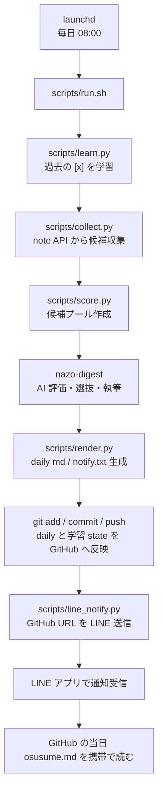

# LINE 通知・携帯閲覧 確定設計

## 方針

今後の通知・携帯閲覧機能は、次の2段階で進めます。

- Phase 1: ローカル Mac で日次処理を実行し、成果物を GitHub に自動 push したあと、LINE Messaging API で当日の GitHub URL を送る
- Phase 2: UI から `気になる` フィードバックを返し、その情報で学習する仕組みを検討する

この設計書では Phase 1 を実装対象として確定します。Phase 2 は将来検討の入口だけを残します。

## Phase 1 の完成状態

毎朝の処理が終わると、携帯の LINE に以下のような通知が届きます。

```text
謎解きnote収集
本日 27件 / おすすめ1位: 難易度:★★★★☆...

今日のダイジェスト:
https://github.com/<owner>/<repo>/blob/<branch>/daily/2026-06-01-osusume.md
```

ユーザーは LINE の URL をタップし、GitHub 上の `daily/YYYY-MM-DD-osusume.md` を携帯で確認します。

## 全体フロー



## 使うサービス

- LINE Messaging API
- GitHub public repository
- 現行のローカル Mac + launchd

`LINE Notify` は使いません。LINE Notify は 2025-03-31 にサービス終了済みのため、通知は LINE 公式アカウントの Messaging API から push message として送ります。

## GitHub 公開範囲

Phase 1 では、最終的に public になる GitHub repository に、携帯で読むための成果物だけを push します。通知 URL は public repository の Markdown 表示 URL です。

push 対象:

- `daily/YYYY-MM-DD-osusume.md`
- `state/weights_base.json`

push 対象外:

- `state/.env`
- `state/.claude_token`
- `state/*.log`
- `state/feedback.jsonl`
- `state/seen.json`
- `state/weights_learned.json`
- `state/candidates_raw.json`
- `state/candidates.json`
- `state/candidates_top.json`
- `state/assessments.json`
- `state/selection.json`
- `state/today.txt`
- `state/notify.txt`
- `daily/YYYY-MM-DD.md`

`daily/YYYY-MM-DD.md` は全件チェックリスト兼ローカル学習用です。public GitHub には載せず、LINE から読む対象は `daily/YYYY-MM-DD-osusume.md` だけにします。

## 環境変数管理

LINE と GitHub URL に関する設定は env ファイルで管理します。

ファイル:

```text
state/.env
```

`.gitignore` に `state/.env` を追加し、絶対に commit しません。

設定例:

```sh
MOBILE_NOTIFY_ENABLED=1
LINE_CHANNEL_ACCESS_TOKEN=...
LINE_TO_USER_ID=Uxxxxxxxxxxxxxxxxxxxxxxxxxxxxxxxx
GITHUB_DAILY_URL_TEMPLATE=https://github.com/<owner>/<repo>/blob/<branch>/daily/{date}-osusume.md
CLAUDE_CODE_OAUTH_TOKEN=sk-ant-...
```

`scripts/run.sh` と `scripts/line_notify.py` は、この env ファイルを読みます。LINE 通知の必須値が欠けている場合、LINE 通知はスキップし、日次処理自体は失敗扱いにしません。Claude token は既存の `state/.claude_token` も後方互換として読めます。

## LINE 側セットアップ

1. LINE Developers で Provider を作成する
2. Messaging API channel を作成する
3. 紐づく LINE 公式アカウントを作成する
4. 自分の LINE アカウントで公式アカウントを友だち追加する
5. Channel access token を発行する
6. 自分の user ID を取得し、`LINE_TO_USER_ID` に設定する

Phase 1 は自分宛ての `push message` 固定です。

## 追加スクリプト

### `scripts/line_notify.py`

日次成果物の URL を LINE に送るスクリプトです。

責務:

- `state/.env` を読む
- `state/today.txt` から日付を読む
- `state/notify.txt` から通知本文を読む
- `GITHUB_DAILY_URL_TEMPLATE` の `{date}` を日付へ置換する
- LINE Messaging API の push endpoint に text message を送る
- 送信結果を標準出力へ簡潔に出す
- 失敗しても exit code は 0 にする
- `MOBILE_NOTIFY_ENABLED=0` の場合は送信せずに正常終了する

送信先:

```text
POST https://api.line.me/v2/bot/message/push
```

送信 payload:

```json
{
  "to": "Uxxxxxxxxxxxxxxxxxxxxxxxxxxxxxxxx",
  "messages": [
    {
      "type": "text",
      "text": "謎解きnote収集\n本日 27件 / おすすめ1位: ...\n\n今日のダイジェスト:\nhttps://github.com/<owner>/<repo>/blob/<branch>/daily/2026-06-01-osusume.md"
    }
  ]
}
```

## `run.sh` 変更設計

`scripts/run.sh` は現行の日次処理を完了したあと、GitHub push と LINE 通知を実行します。

追加する順序:

1. `render.py` で `daily/*.md` と `state/notify.txt` を生成する
2. 当日の読む用ダイジェストだけを `git add` する
3. 差分があれば commit する
4. commit が作られた場合だけ push する
5. push 成功後に `scripts/line_notify.py` を実行する
6. 最後に従来どおり Mac ローカル通知も出す

疑似コード:

```sh
TODAY="$(cat state/today.txt)"

git add \
  "daily/${TODAY}-osusume.md"

if ! git diff --cached --quiet; then
  git commit -m "Add daily digest ${TODAY}"
  git push
  "$PY" scripts/line_notify.py || true
else
  echo "[info] no git changes; skip push and LINE notification"
fi
```

push 失敗時は LINE 通知を送らず、`state/run.log` に警告を残します。携帯で開く URL が未更新のまま通知されるのを防ぐためです。

## `.gitignore` 変更設計

public GitHub に載せないファイルを Git の追跡対象から外します。

```gitignore
# ローカル個人設定・秘密情報
.claude/settings.local.json
.env
.env.*
state/.env
state/.claude_token

# 実行時 state・ログ・中間ファイル
state/*
!state/weights_base.json

# 公開 GitHub に載せる daily は読む用ダイジェストだけ
daily/*.md
!daily/*-osusume.md
```

すでに追跡されている対象外ファイルは、作業ファイルを残したまま `git rm --cached` で監視から外します。

## 料金・配信数

LINE Messaging API の push message は、LINE 公式アカウントのメッセージ通数としてカウントされます。Phase 1 は自分宛てに毎日1通だけ送る前提なので、月30通程度です。

無料通数と追加送信可否は国・地域と料金プランに依存するため、運用前に LINE 公式の料金ページで確認します。

## Phase 2 の検討範囲

Phase 2 では、携帯 UI から `気になる` を返し、そのフィードバックで学習する機能を検討します。

方針:

- `daily/*.md` を携帯で直接編集する方式にはしない
- UI 上の `気になる` 操作を feedback として保存する
- 保存された feedback から、現行の `weights_learned.json` と同じ考え方で機械学習する
- どの記事が `気になる` されたかを key と tags で記録する

Phase 2 で決めること:

- UI の置き場所
- feedback の保存先
- LINE / Web UI / GitHub 連携の認証
- `learn.py` との接続方法

## 実装順

1. `.gitignore` に `state/.env` を追加
2. `state/.env` のテンプレートを README または docs に記載
3. `scripts/line_notify.py` を追加
4. `run.sh` に git add / commit / push を追加
5. `run.sh` に push 成功後の LINE 通知を追加
6. LINE Messaging API へテスト通知を送る
7. 手動で `zsh scripts/run.sh` を実行して GitHub push と LINE 通知を確認
8. launchd 実行で翌朝も同じ流れになることを確認

## 参考公式ドキュメント

- [LINE Notify service has been terminated as of March 31, 2025](https://developers.line.biz/en/news/2025/04/01/line-notify/)
- [LINE Messaging API - Send messages](https://developers.line.biz/en/docs/messaging-api/sending-messages/)
- [LINE Messaging API pricing](https://developers.line.biz/ja/docs/messaging-api/pricing/)
